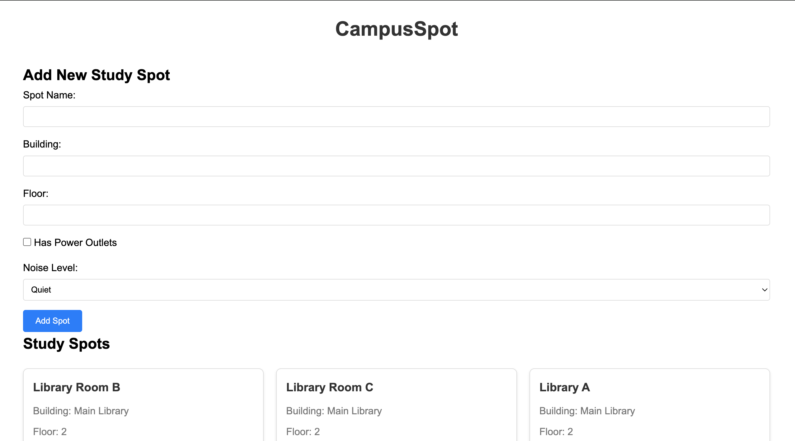

# CampusSpot

A web application for discovering and sharing study spots on campus.

## Author
Daiki Koike

## Class Link
[Web Development Spring 2025](https://johnguerra.co/classes/webDevelopment_spring_2025/)

## Project Objective
CampusSpot helps students find and share the best study spots on campus. Users can:
- Discover study locations
- View spot details (power outlets, noise level, etc.)
- Share their experiences through reviews
- Browse other students' recommendations

## Screenshots

The main interface of CampusSpot showing the spot submission form and list of available study spots.

## Technologies Used
- Frontend: Vanilla JavaScript, HTML5, CSS3
- Backend: Node.js, Express
- Database: MongoDB
- Deployment: Vercel

## Getting Started

### Prerequisites
- Node.js (v14 or higher)
- MongoDB account
- npm or yarn

### Installation
1. Clone the repository:
```bash
git clone [your-repo-url]
```

2. Install dependencies:
```bash
npm install
```

3. Create a `.env` file based on `.env.example` and fill in your credentials.

4. Start the development server:
```bash
npm run dev
```

5. Visit `http://localhost:3000` in your browser.

## API Documentation
The application provides the following API endpoints:

### Spots
- GET `/api/spots` - Get all study spots
- POST `/api/spots` - Create a new study spot
- GET `/api/spots/:id` - Get specific spot details

### Reviews
- GET `/api/reviews/spot/:spotId` - Get reviews for a specific spot
- POST `/api/reviews` - Create a new review

## License
This project is licensed under the MIT License - see the LICENSE file for details.
